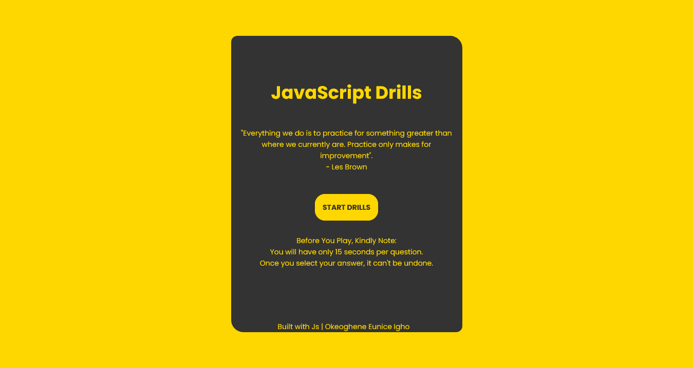

# JavaScript-Drills

I love games, well because games are super cool and also because its a cool way to solidify one's knowledge on a concept.
Welcome to My JavaScript Drill!!! A fun way to test your knowledge on JavaScript.

## Table of contents

- [Overview](#overview)
  - [Screenshot](#screenshot)
  - [Links](#links)

## Overview

A major challenge for me was figuring out a way to store the scores and get the timer working all at the same time, roughly took me two days of trial and error.
P.S: I absolutely love when my code is free of bugs...I literally do flip flops, so hours of trial and error, googling and watching videos, paid off and now we have this beautiful game.
Feel free to give me feedback on what you think about this game...I would absolutely Love to hear from you... [Chat Me Up!](#dev)

### Screenshot

### Links

- Solution URL: [https://github.com/Igho-Okeoghene/JavaScript-Drills](https://github.com/Igho-Okeoghene/JavaScript-Drills)
- Live Site URL: [https://igho-okeoghene.github.io/JavaScript-Drills/](https://igho-okeoghene.github.io/JavaScript-Drills/)

## Dev

- Website - [Okeoghene Eunice Igho](https://github.com/Igho-Okeoghene)
- Linkedin - [Okeoghene Eunice Igho](http://www.linkedin.com/in/okeoghene-eunice-igho)
- Twitter - [@Eunicodes](https://www.twitter.com/eunicodes)
